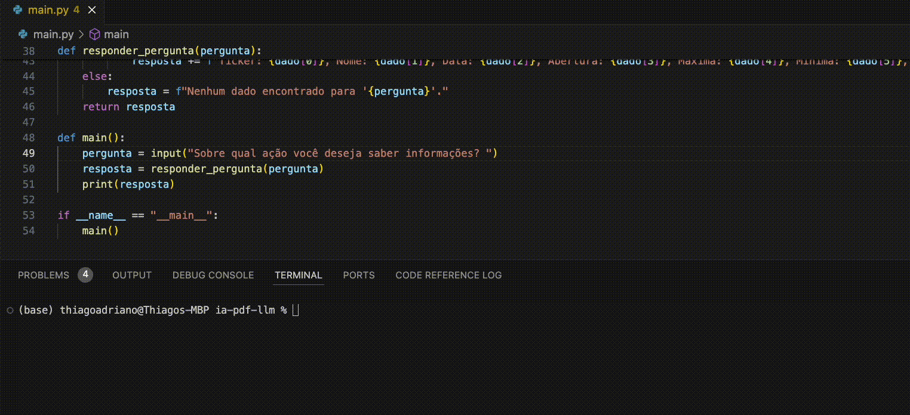

# Sistema de Perguntas e Respostas sobre Ações

Este projeto permite que os usuários façam perguntas sobre ações via terminal e obtenham respostas formatadas com base nos dados disponíveis em um banco de dados PostgreSQL.

## Pré-requisitos

- Python 3.7 ou superior
- PostgreSQL
- Conta e chave de API da OpenAI

## Instalação

1. Clone o repositório
2. Execute os comandos abaixo no seu terminal:

```shell
python -m venv venv
source venv/bin/activate  # Linux/Mac
venv\Scripts\activate  # Windows
pip install -r requirements.txt
```

3. Crie um arquivo `.env` na raiz do projeto e adicione as seguintes variáveis:

```shell
OPENAI_API_KEY=sua-chave-api-aqui
DB_NAME=sua_base_de_dados
DB_USER=seu_usuario
DB_PASSWORD=sua_senha
DB_HOST=seu_host
DB_PORT=sua_porta
```

## Configuração do Banco de Dados

```shell
-- Criação da tabela de ações
CREATE TABLE stocks (
    id SERIAL PRIMARY KEY,
    ticker VARCHAR(10) NOT NULL UNIQUE,
    name VARCHAR(255) NOT NULL,
    sector VARCHAR(255),
    industry VARCHAR(255)
);

-- Criação da tabela de preços das ações
CREATE TABLE stock_prices (
    id SERIAL PRIMARY KEY,
    stock_id INT REFERENCES stocks(id),
    date DATE NOT NULL,
    open NUMERIC(10, 2),
    high NUMERIC(10, 2),
    low NUMERIC(10, 2),
    close NUMERIC(10, 2),
    volume INT,
    UNIQUE(stock_id, date)
);

-- Inserção de dados na tabela de ações
INSERT INTO stocks (ticker, name, sector, industry) VALUES
('AAPL', 'Apple Inc.', 'Technology', 'Consumer Electronics'),
('MSFT', 'Microsoft Corporation', 'Technology', 'Software'),
('GOOGL', 'Alphabet Inc.', 'Communication Services', 'Internet Content & Information');

-- Inserção de dados na tabela de preços das ações
INSERT INTO stock_prices (stock_id, date, open, high, low, close, volume) VALUES
(1, '2023-05-20', 150.00, 155.00, 149.00, 154.00, 1000000),
(2, '2023-05-20', 250.00, 255.00, 249.00, 254.00, 2000000),
(3, '2023-05-20', 2700.00, 2750.00, 2690.00, 2740.00, 1500000);
```





## Licença
Este projeto está licenciado sob a licença MIT. 


   
